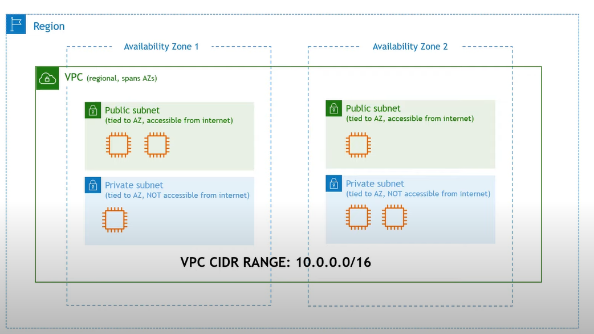
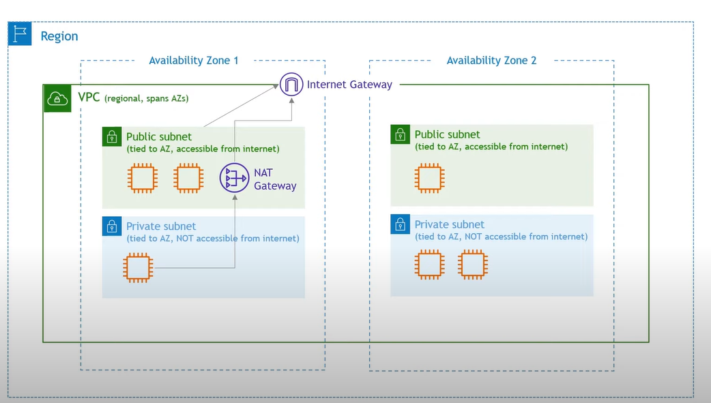

# Create mysql stored procedure 
`create procedure employees.Getname()
select *
from employees;
;

create procedure employees.GetA()
select *
from employees
where first_name = 'Alain' and gender='M' and emp_no>=654161;`

## Populate mysql database.  

## Virtual Private Cloud (VPC)
* Your private cloud/network within the cloud
* Isolates your resources from everyone else's

* Networking 

* Each subnet in a VPC has an associated route table. A subnet is considered public if routed to the internet via an internet gateway. 
each VPC belong to the region belonging to one or more available zone 

* Classless inter-domain Routing (CIDR)[cidr.xyz]: Notation for Describing blocks of IP addresses assigned in the vpc level

 (https://www.youtube.com/watch?v=7_NNlnH7sAg)
The diagram has 6 EC2 instances, each requiring its IP address. If we add a database, it will also need an IP address. Therefore, ensuring that our VPC has enough available IP addresses is important. To do this, we need to define a netmask that will provide an adequate number of IP addresses.
* Internet gateway: The public subnet has a route to it, the private subnet does not have that route, we can't get to it from the internet, or we can't get to it out to the internet. How to get to the internet in case we need to update the patch or download a file from the internet? we don't want the outside world to get into it, but we want it to get access to the internet, in that context, we have to use the NAT Getaway (NAT: Network access translation), for this, we have to create a NAT gateway in the public subnet and add the route from the private subnet to its, then add the route from the nat gateway to the internet gateway and from it to internet. That is how we enable private resources to get internet access. 

* Network ACLS and Security Groups: how to secure everything
- Network ACL is a firewall that controls traffic in/out of a subnet, it has rules for allow and deny. Rules include IP addresses only
- Security groups: Firewall that controls traffic in/out of an EC2 instance, it only has rules to allow, Rules include IP addresses and other security groups

